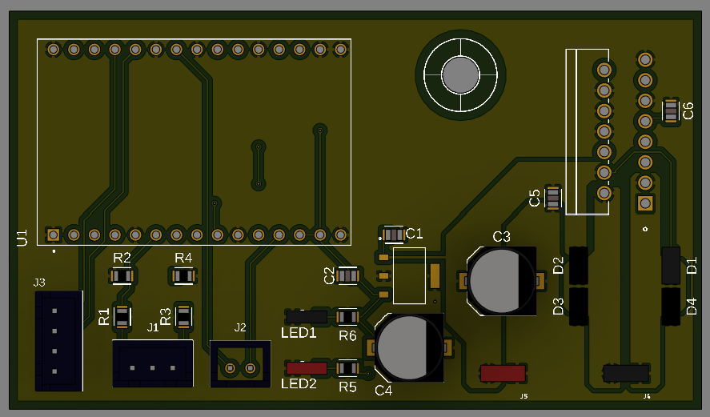
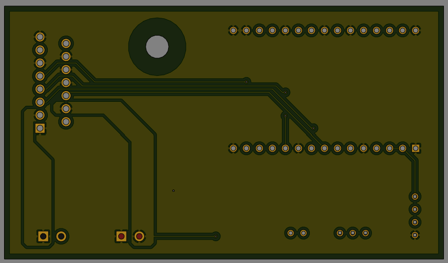

# PCB

## inleiding

Ideal zouden we een PCB kunnen maken. Hier een korte aanzet om er aan te starten.

## Project files

De files zijn de archive en de .lbr.

## componenten

### Connectoren

Wel we hebben connectoren nodig.

- Connectoren set: https://www.amazon.com.be/-/en/YIXISI-Pieces-Connector-Connectors-Terminals/dp/B082ZLYRRN/ref=sr_1_1?crid=1NRPVG0VJ7JD6&keywords=Litorange%2B500%2Bx%2BJST%2BMale%2Band%2BFemale%2B2.54mm%2BJST-XH%2BJST%2BConnector%2Bwith%2BFemale%2BPin%2BConnector%2BWhite&qid=1701683827&s=home-improvement&sprefix=litorange%2B500%2Bx%2Bjst%2Bmale%2Band%2Bfemale%2B2.54mm%2Bjst-xh%2Bjst%2Bconnector%2Bwith%2Bfemale%2Bpin%2Bconnector%2Bwhite%2B%2Chome-improvement%2C73&sr=1-1&th=1
- Screw Terminals: https://be.farnell.com/multicomp-pro/mp011984/tb-wire-to-brd-r-a-2way-18awg/dp/4179014?st=screw%20terminals

### Gekozen componenten

De gebruikte componenten:
 - L298N : https://be.farnell.com/stmicroelectronics/l298n/ic-bridge-driver-dual-298/dp/403295?ICID=I-RP-STM7REC-1
 - ESP32 (->devkit<-) : https://www.mouser.be/ProductDetail/Espressif-Systems/ESP32-C3-DevKitC-02?qs=stqOd1AaK7%2F1Q62ysr4CMA%3D%3D
 - Voltage regulators : 
    -  5V: https://be.farnell.com/diodes-inc/az1117ch2-5-0trg1/ldo-dc-dc-conv-5v-0-8a-sot-223/dp/3942512
 - Diode: https://be.fa rnell.com/taiwan-semiconductor/es1dl-r3g/diode-ultra-fast-smf-1a-200v/dp/1559127
 - LEDs:
    - Green: https://be.farnell.com/multicomp-pro/mp008255/led-green-80mcd-576nm-1206/dp/3796283
    - Red: https://be.farnell.com/multicomp-pro/mp008281/led-red-100mcd-638nm-1206/dp/3796312
 - Weerstanden en condesatoren: Zie bomlijst.

 ### Reden keuze

Zie architectuur documenten om te zien wat we willen berijken.  

- L298N: Het is een veel gebruikte motordriver en simple te gebruiken.
- ESP32 Devkit: Dit hebben we liggen en het is dan gemakelijker om een pcb te maken. Moet geen rekening houden met de USB -> UART interface en we hebben dan geen 3.3V LDO meer nodig dan.
- Voltage regulator: we hebben 5V nodig voor de ESP en de MotorDriver te logica te voeden.

## Elektrisch schema

## PCB layout

