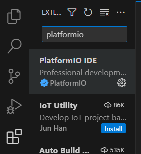
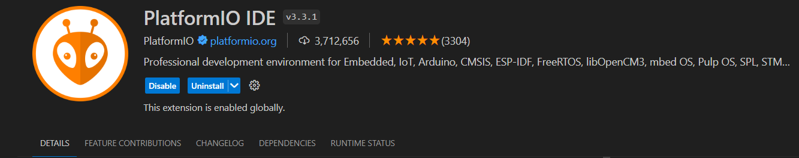

# Programma's

Om onze auto te laten rijden met behulp van een joystick, moeten we programmeren. Er zijn verschillende programma's om de verschillende delen van het project te testen. Deze programma's vormen allemaal bouwstenen die uiteindelijk het eindprogramma vormen.

## Voorbereiding 

Om te kunnen programmeren moeten we eerst verschillende programma's downloaden. 

### Arduino

Als je de verschillende tussenprogramma's wilt testen zul je arduino moeten downloaden. Dit kun je makkelijk downloaden via volgende
[Link](https://support.arduino.cc/hc/en-us/articles/360019833020-Download-and-install-Arduino-IDE "Arduino downloaden"). Arduino is een open-source elektronisch platform dat programmeerbaar is en gemakkelijk te gebruiken, zelfs voor beginners.

### Visual Studio Code

Ons eindprogramma wordt ontwikkeld in Visual Studio Code. Om deze code naar de ESP32 te uploaden, maken we gebruik van PlatformIO. Visual Studio Code is eenvoudig te downloaden en te gebruiken. Je kunt het downloaden vanaf de officiële [website](https://code.visualstudio.com/download).

In Visual Studio Code moeten we nu PlatformIO downloaden. Als je links op "Extensions" klikt symbool met de vierkantjes, kun je zoeken naar PlatformIO en het vervolgens installeren.

| Opzoeken PlarformIO | PlarformIO installeren |
|--------------|--------------|
|  ||

Om het eindprogramma te openen, ga je naar de map 'Eindprogramma' en open je Visual Studio Code via de terminal. Dit doe je door met de rechtermuisknop te klikken in de map 'Eindprogramma' en te kiezen voor 'Openen in terminal'. Zodra je in de terminal bent, typ je "code ." en druk je op Enter. Nu kun je het programma in Visual Studio Code uploaden naar je ESP32.