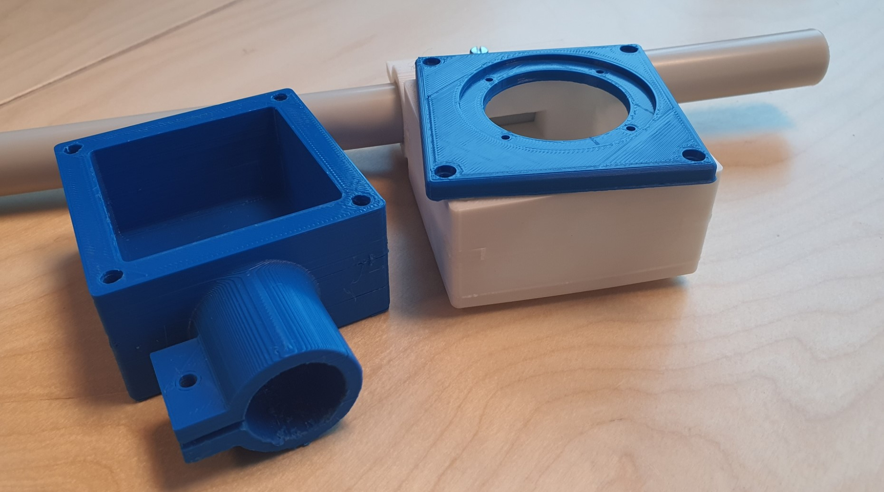

# GoBabyGo2.0

# Inhoudsopgave
1. [Inleiding](#inleiding)
2. [Nodige Onderdelen](#nodige-onderdelen)
3. [BOMlijst](#bomlijst)
4. [Rand Info](#rand-info)
5. [Digitale Joystick](#digitale-joystick)
6. [Analoge Joystick](#analoge-joystick)
7. [Motor Driver](#motor-driver)
8. [Potentiometer](#potentiometer)
9. [DC-DC Buck Converter](#dc-dc-buck-converter)
10. [Montage Ideeën](#montage-ideeën)
11. [PCB](#PCB)
12. [ESP32 Pinout](#esp32-pinout)

Alle info over het installeren van nodige programma's om te kunnen programmeren staat in het mapje [Programma's](./Programma's)

## inleiding
Ons doel is om kinderen met beperkte mobiliteit meer bewegingsvrijheid te geven. We vervangen het traditionele pedaal in auto's door een joystick die via een afstandsbediening kan worden bediend. De afstandsbediening heeft voorrang op de joystick. We hebben twee concepten voor de bevestiging van de joystick aan de auto: een dashboardmontage die de joystick van links naar rechts verplaatst, en een zijkantmontage die aan beide kanten kan worden geplaatst. Het brein van de auto is een ESP die de joystickinvoer leest en de motoren aanstuurt. Omdat de positie van de voorwielen niet kan worden ingelezen met de bestaande auto hardware, gebruiken we een potentiometer om dit probleem op te lossen.

## Nodige onderdelen

- Auto
- MicroController
- Motor driver voor te kunnen sturen
- Joystick
- DC-DC Converter

## BOMlijst
| **Onderdeel**            | **Prijs** | **Link**                                                                                                                                                                                                                                                                |
|--------------------------|-----------|-------------------------------------------------------------------------------------------------------------------------------------------------------------------------------------------------------------------------------------------------------------------------|
| **Motor Driver**         | €5.29     | https://www.amazon.com.be/-/en/OcioDual-Stepper-Electronics-Projects-Raspberry/dp/B07YNR5KWP/ref=sr_1_10?crid=13WDD3RB1V2TC&keywords=l298n+motor+driver&qid=1695624708&sprefix=l298n+motor+driver%2Caps%2C69&sr=8-10                                                    |
| **ESP32**                | €11.37    | https://www.amazon.com.be/-/en/ESP-32S-Development-Antenna-Bluetooth-Arduino/dp/B07XH45MWW/ref=sr_1_27?crid=2R7CSQ30VFE6H&keywords=esp32&qid=1695629494&sprefix=esp32%2Caps%2C166&sr=8-27&th=1                                                                          |
| **Joystick**             | €14.21    | https://www.amazon.com.be/-/en/Potentiometer-JH-D202X-R2-Controller-Photography-Accessories/dp/B09J2C4DN5/ref=sr_1_3?crid=357R56FNH75R6&keywords=Joystick+potentiometer+JH-D202X-R4+10K&qid=1695624613&sprefix=joystick+potentiometer+jh-d202x-r4+10k%2Caps%2C66&sr=8-3 |
| **DC-DC Buck Converter** | €11.88    | https://www.amazon.com.be/-/en/Hailege-Converter-1-25-36V-Adjustable-Step-down/dp/B07XRF9NWP/ref=sr_1_7?crid=1PQTSHA11MF1Q&keywords=dc+to+dc+buck+converter+adjustable&qid=1695628749&sprefix=dc+to+dc+buck+converter+adjustable%2Caps%2C71&sr=8-7                      |
| **Optocoupler** | €7.85    | https://www.amazon.com.be/-/en/BOJACK-Optocoupler-Installation-Spacing-Package/dp/B08CXKZ98W/ref=sr_1_6?crid=1FXUJNO9624LN&keywords=optocoupler&qid=1695634939&sprefix=optocoupler%2Caps%2C69&sr=8-6                      |
| **Connector PCB-Kabels** | €10.24    | https://www.amazon.com.be/-/en/Litorange-Female-2-54mm-JST-XH-Connector/dp/B086W9HB3M/ref=sr_1_1?crid=SXDRC5SCF07L&keywords=Picture+1+of+24+Click+to+enlarge+Have+one+to+sell%3F+Sell+it+yourself+Terminal+Board+Connectors+JST+Male+Female&qid=1695648512&s=home-improvement&sprefix=picture+1+of+24+click+to+enlarge+have+one+to+sell+sell+it+yourself+terminal+board+connectors+jst+male+female%2Chome-improvement%2C199&sr=1-1                      |
| **Connector kabels-kabels** | €13.99    | https://www.amazon.com.be/-/en/HSeaMall-Connector-Female-Housing-Assortment/dp/B0716WZ6RW/ref=sr_1_12?crid=3B4MFSYF52HO6&keywords=JST+conector+set&qid=1696247641&s=home-improvement&sprefix=jst+conector+set%2Chome-improvement%2C66&sr=1-12                     |
| **potentiometer** | €9.11    | https://www.amazon.com.be/-/en/Potentiometer-Rotating-Automotive-Electronics-Multimedia/dp/B09BJMFVMZ/ref=sr_1_11?crid=3GKNUFMRX9EJO&keywords=potentiometer+10k&qid=1696248212&s=home-improvement&sprefix=potentiometer+10k%2Chome-improvement%2C259&sr=1-11                      |

## Rand info

Batterij is 12v 

De huidige electronica komen de kabels met het volgende overeen:

De 7Pin Connector:
- Blauw: low high speed
- geel: vooruit
- Groen: achteruit
- zwart: grond
- empty
- wit: aanuitknop
- rood: aanuitknop

## Digitale Joystick
Om de auto te besturen zullen we een joystick gebruiken. De joystick die we in het begin tot onze beschikking hebben, is digitaal. 
In de toekomst overwegen we mogelijk over te schakelen naar een analoge joystick. Hoe je de joystick kunt binnenlezen kun je vinden onder het mapje [Programma's](./Programma's).

Zorg er voor dat de connector links onder zit dan klopt het schema.

## Analoge Joystick
Na het gebruik van een digitale joystick stappen we nu over naar een analoge variant voor het besturen van de auto. Een analoge
joystick maakt gebruik van variabele weerstand, waardoor we een vloeiendere en nauwkeurigere stuurinvoer kunnen realiseren. Ons
eindprogramma zal dan ook ontwikkeld worden met een analoge joystick. We hebben echter geen tussen programma's voor de analoge
joystick, omdat we deze al hebben gemaakt voor de digitale variant. Het zou overbodig zijn om dit proces opnieuw uit te voeren voor
de analoge joystick.

Een analoge joystick heeft twee potmeters. De beweging van de joystick zorgt voor variabele weerstand. Elke potmeter vertegenwoordigt
een richting: vooruit en achteruit (y-as) en links en rechts (x-as). Deze weerstanden worden omgezet in elektrische signalen, die
vervolgens worden gebruikt om de auto aan te sturen.

## Motor driver
Om de richting te bepalen van de auto gebruiken we een motortje. Dit motortje wordt aangestuurd a.d.h.v een driver. 
Via deze driver kunnen we de richting en de snelheid van de motor bepalen. De driver die wij gebruiken is de L298N.
Hoe je de driver kunt gebruiken met een ESP kun je vinden in het mapje [Programma's](./Programma's).

De L298N is een motorcontroller-IC dat vaak wordt gebruikt in elektronische projecten. Het maakt gebruik van een H-brug-configuratie, waardoor het mogelijk is om
gelijkstroommotoren in beide richtingen aan te sturen. Met twee onafhankelijke kanalen is het geschikt voor het afzonderlijk aansturen van twee motoren, zoals bij
robotica wij gebruiker hier maar 1 van. Het ondersteunt een breed spanningsbereik en wordt gecontroleerd met logische signalen van bijvoorbeeld een microcontroller
zoals Arduino.

 

- Oranje,Paars: Richting motor
- Groen: Snelheid motor

## Potentiometer
Om de positie van onze wielen vast te stellen, maken we gebruik van een potentiometer. Een potentiometer, kortweg pot meter, is een elektronisch component dat wordt
ingezet om een variabele weerstand te creëren in een elektrisch circuit. In ons geval genereren we een analoog signaal op basis van deze weerstandswaarden, waarmee we
de positie van het stuur kunnen bepalen. Concreet wordt de potentiometer aan de stang bevestigd, die op zijn beurt is gekoppeld aan de wielen van de auto. Wanneer de
wielen van positie veranderen, wijzigt ook de positie van de potentiometer, waardoor we nauwkeurig de positie van de wielen kunnen achterhalen.

## DC-DC Buck Converter
Omdat niet al onze componenten op dezelfde spanning werken gebruiken we een Buck converter. Deze zorgt er voor dat we een hogere spanning
kunnen omzetten naar een lagere spanning. In de auto hebben we een baterij ter beschikking van 12 Volt maar onze esp heeft maar 5 volt nodig. 

Een DC-DC buck converter is een elektronisch apparaat dat de ingangsspanning van een gelijkstroombron verlaagt naar een lagere uitgangsspanning. Het werkt als een
efficiënte schakelende regelaar met behulp van componenten zoals transistors en een spoel (inductor). Deze converters worden veel gebruikt in elektronische apparaten om
de benodigde lagere spanning te leveren, zoals in batterijgevoede apparaten en voedingen voor microcontrollers.

## montage ideeën
De joystick mag niet te veel ruimte innemen in de auto. Deze is geplaatst in een 3D-geprinte behuizing die aan een PVC-buis is bevestigd. We hebben voor een PVC-buis gekozen vanwege het lichte gewicht en de
mogelijkheid om de bekabeling erin te verbergen. We hebben twee concepten ontwikkeld voor het monteren van de joystick in de auto. Bij het eerste concept is de buis bevestigd aan het dashboard. Voor het tweede
concept wordt de buis aan de deur gemonteerd. In beide concepten kan de joystick links of rechts worden geplaatst, afhankelijk van de mobiliteit van het kind. We bevestigen de buizen met clips aan de auto.

## PCB

### Inleiding

Meer info staat in de PCB directory.

### PCB layout

## ESP32 Pinout
- Driver
  - In1 = GPIO23
  - In2 = GPIO22
  - ENA = GPIO21
  - Channel = GPIO13

- Huidige elektronica
  - Forward = GPIO15
  - Backward = GPIO19
- Joystick
  - Xpin = GPIO2
  - Ypin = GPIO4

- Potentiometer
  - potPin = GPIO14
